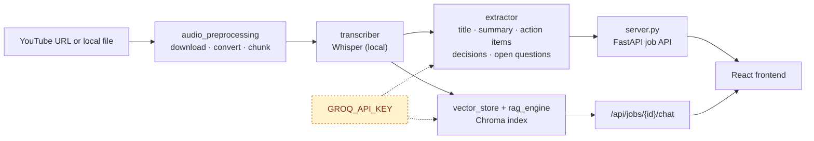

https://github.com/user-attachments/assets/eaf49a6b-fdaa-423d-82ca-e4dfa987ba47


# Alex

Alex turns a YouTube link or a local audio/video file into a structured, searchable brief. It transcribes the audio locally with Whisper, extracts a title, summary, action items, key decisions, and open questions with an LLM, and indexes the transcript so you can chat with the content afterwards.

The project consists of a FastAPI backend and a React frontend (`frontend/`).


## Features

- Accepts a YouTube URL or a local audio/video file
- Transcribes audio locally with OpenAI Whisper — no audio leaves the machine
- Extracts title, summary, action items, key decisions, and open questions in a single structured LLM call
- Indexes the transcript in a Chroma vector store for retrieval-augmented chat
- Web UI with live processing status and a chat panel

## Architecture



| Stage | Module | Responsibility |
|---|---|---|
| Ingestion | `util/audio_preprocessing.py` | Downloads (yt-dlp) or accepts a local file, converts to mono 16kHz WAV, chunks it |
| Transcription | `core/transcriber.py` | Transcribes each chunk with a local Whisper model |
| Extraction | `core/extractor.py` | Single LLM call returning title, summary, action items, decisions, and open questions as JSON |
| Indexing & chat | `core/vector_store.py`, `core/rag_engine.py` | Embeds the transcript into Chroma and answers questions grounded in it |
| API | `server.py` | FastAPI endpoints for job submission, polling, upload, and chat |

All LLM calls run through LangChain (LCEL) backed by Groq (`ChatGroq`).

## Project structure

```
src/alex/
├── main.py                # CLI entry point
├── server.py               # FastAPI backend
├── core/
│   ├── extractor.py         # Title, summary, action items, decisions, questions
│   ├── transcriber.py       # Whisper transcription
│   ├── rag_engine.py        # RAG chat chain
│   └── vector_store.py      # Chroma vector store
└── util/
    └── audio_preprocessing.py

frontend/
└── src/
    ├── App.tsx              # Input → processing → results
    ├── api.ts               # Backend client
    └── components/
```

## Requirements

- Python >= 3.12
- Node.js
- [FFmpeg](https://ffmpeg.org/) on PATH (required by `pydub` and `yt-dlp`)
- A [Groq API key](https://console.groq.com/)

## Setup

```bash
# Backend
uv sync                  # or: pip install -r requirements.txt

# Frontend
cd frontend && npm install
```

Create a `.env` file in the project root:

```
GROQ_API_KEY=your_groq_api_key_here
```

## Running

```bash
# Terminal 1 — API
uv run uvicorn alex.server:app --app-dir src --port 8000

# Terminal 2 — frontend
cd frontend && npm run dev
```

Open the URL Vite prints (usually `http://localhost:5173`), submit a YouTube URL or a file, and review the results.

### CLI

```bash
uv run python -m alex.main
```

Runs the pipeline end-to-end in the terminal and drops into a chat loop over the transcript.

## Configuration

| Variable | Purpose |
|---|---|
| `GROQ_API_KEY` | Authenticates LLM calls for extraction and chat |

## Tech stack

**Backend:** FastAPI, LangChain, Groq, OpenAI Whisper, Chroma, sentence-transformers, yt-dlp, pydub

**Frontend:** React, TypeScript, Vite, Tailwind CSS
