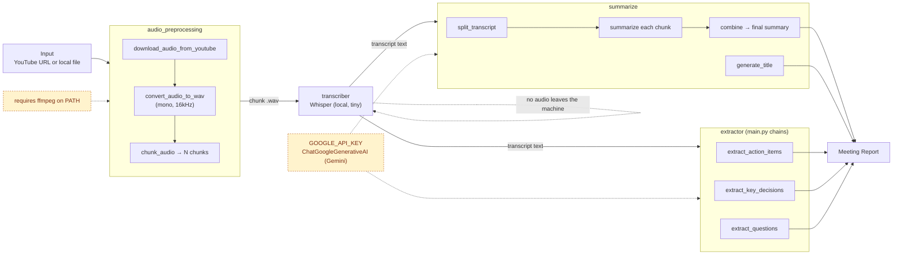

# Alex

Alex is an AI meeting assistant that turns a YouTube link or a local audio/video file into a structured meeting summary. It downloads or ingests the audio, transcribes it locally with Whisper, summarizes it in chunks with an LLM, and extracts action items, key decisions, and open questions.

## Features

- Accepts a YouTube URL or a local audio file as input
- Downloads and normalizes audio (mono, 16kHz WAV) and splits it into fixed-length chunks
- Transcribes each chunk locally using OpenAI Whisper (no audio leaves the machine)
- Summarizes long transcripts with a map-reduce style chunked summarization pipeline
- Generates a short meeting title from the transcript
- Extracts action items (with owner and deadline), key decisions, and unresolved questions
- Built on LangChain (LCEL) with a Google Gemini chat model

## Architecture



Audio is downloaded and chunked, transcribed locally with Whisper, then the transcript fans out to summarization and extraction — both calling Gemini through `GOOGLE_API_KEY` — before the results merge into one report.

The pipeline has four stages, each in its own module:

1. **Audio ingestion** (`util/audio_preprocessing.py`) - downloads audio from a YouTube URL with `yt-dlp`, or accepts a local file, converts it to mono 16kHz WAV with `pydub`, and splits it into fixed-length chunks.
2. **Transcription** (`core/transcriber.py`) - runs each chunk through a local Whisper model and returns the transcribed text.
3. **Summarization** (`core/summarize.py`) - splits the transcript into text chunks, summarizes each chunk with an LLM, combines the partial summaries into one final summary, and generates a short meeting title.
4. **Extraction** (`main.py`) - runs three separate LLM chains over the full transcript to pull out action items, key decisions, and open questions.

All LLM calls go through LangChain LCEL chains backed by `ChatGoogleGenerativeAI` (Gemini).

## Project structure

```
src/alex/
├── main.py                       # LLM chains: action items, key decisions, open questions
├── core/
│   ├── extractor.py               # (in progress)
│   ├── summarize.py               # Chunked summarization + title generation
│   └── transcriber.py             # Whisper-based transcription
└── util/
    └── audio_preprocessing.py     # Download, convert, and chunk audio
```

## Requirements

- Python >= 3.12
- [FFmpeg](https://ffmpeg.org/) installed and available on PATH (required by `pydub` and `yt-dlp`)
- A Google API key with access to the Gemini API

## Usage

### 1. Install

This project uses [uv](https://docs.astral.sh/uv/) for dependency management.

```bash
uv sync
```

Alternatively, with pip:

```bash
pip install -r requirements.txt
```

### 2. Configure

Create a `.env` file in the project root with your Gemini key:

```
GOOGLE_API_KEY=your_google_api_key_here
```

### 3. Run

Ingest, transcribe, summarize, and extract in sequence:

```python
from alex.util.audio_preprocessing import process_input
from alex.core.transcriber import transcribe_chunk_whisper
from alex.core.summarize import summarize, generate_title
from alex.main import extract_action_items, extract_key_decisions, extract_questions

# 1. Download/ingest and chunk the audio
chunks = process_input("https://youtu.be/your-video-id")  # or a local file path

# 2. Transcribe each chunk locally with Whisper
transcript = " ".join(transcribe_chunk_whisper(chunk) for chunk in chunks)

# 3. Summarize and title the meeting
summary = summarize(transcript)
title = generate_title(transcript)

# 4. Extract structured output
action_items = extract_action_items(transcript)
decisions = extract_key_decisions(transcript)
questions = extract_questions(transcript)
```

## Environment configuration

| Variable | Used by | Purpose |
|---|---|---|
| `GOOGLE_API_KEY` | `summarize`, `main` (extractor) | Authenticates `ChatGoogleGenerativeAI` calls to the Gemini API for summarization, title generation, and action item / decision / question extraction. |

## Tech stack

- **LangChain (LCEL)** - LLM orchestration
- **Google Gemini** (`langchain-google-genai`) - chat model for summarization and extraction
- **OpenAI Whisper** - local speech-to-text
- **yt-dlp** - YouTube audio downloading
- **pydub** - audio format conversion and chunking
- **PyTorch / torchaudio** - Whisper backend
